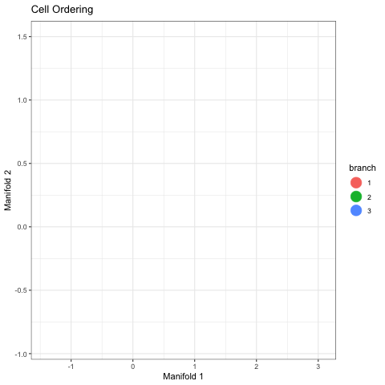

# README


This is the landing page for COMP683 Course Project.

## Getting setup

``` r
# unless you are starting an R session
# from within this directory, source
# the `.Rprofile` from the project root.
source(".Rprofile")

# If running for the first time use the code below to setup SLICER by installing dependencies
# ## SLICER and some other dependencies are no longer on CRAN, thus they must be installed manually
box::use(mods/setup_SLICER[...])

# If you have run the above, future work may be called by doing the above again or the below:
library(SLICER) # traditional
box::use(SLICER[...]) # using `box::use()`
```

# Project Proposal

<!-- include Quarto doc in README -->

## DE with SLICER

> **Note**
>
> This is a work in progress

## Group Members

-   Justin Landis
-   Victor Adediwura

## Abstract

SLICER is a method to select features (genes) to build a trajectory of
cells. In Single Cell RNAseq (scRNAseq), this method may be helpful in
the context of cell differentiation analyses. The goal of our project is
to investigate Differential Expression (DE) approaches to the features
selected by SLICER.

## Formal Statement of the Problem

While SLICER automatically selects genes that are important for defining
a trajectory among the data, it does not associate which features are
most important to defined cell types. <!-- Not sure if this is true -->

## Related Work

@Welch2016

## Contributions

The overall goal of our work is to identify if performing DE based on
branches assignments by SLICER will lead to biologically significant
results.

## Datasets

We will be using data sets from [Single-cell dattasets for temporal gene
expression integration](https://zenodo.org/records/6587903),
specifically utilizing a few Hematopoiesis differentiation dataset (as
there are 2).

## Intended Experiments

As a validation, we will perform Differential Expression analysis on
input data prior to SLICER and then compare the results of the same DE
pipeline, except only on features selected by SLICER. In practicality,
this requires a dataset with some experimental labels which will be used
for differential expression comparisons.

Validation Results:

-   DE on ALL Features, comparing against original experimental labels

Experiments:

-   DE on SLICER Features, comparing against original experimental
    labels

-   DE on SLICER Features, comparing against SLICER branch labels

-   DE on ALL Features, comparing against SLICER branch labels

In experiments where SLICER Features are used, we intend to do a set
comparison between DE genes in validation versus the experiment.

In experiments where SLICER branch labels are used, we NMI to assess if
branches correspond to experimental labels (they may not!)

## Expected Challenges

Immediate challenges will be the disparity between softwares. Data is
stored in a `h5ad` format that can be read into memory via
`scanpy.read_h5ad(...)`. However `SLICER` is implemented in R and will
need to be locally installed as it was [removed from
CRAN](https://cran.r-project.org/web/packages/SLICER/index.html) in
`2022`.

Furthermore, branch assignments seem to be based on the Dimensionality
Reduction of `LLE`, but the actual trajectories through the graph.
Additionally, there is no guarantee to the size of branch assignments
given by SLICER. Assuming one branch is sufficiently small, this may
lead to under powered DE results.

## Implementation

Since `SLICER` is implemented in R, we will be implementing our DE in R
as well. Our code will be posted on
[GitHub](https://github.com/jtlandis/Comp683-Proj)

## Preliminary Results



### Notes

As a validation - Perform DE on data set against a known assigned labels
(data set must be an RNAseq dataset as we do not know how to do DE with
Cytoph – Natalie??)

-   Use SLICER Workflow
    -   Potentially use Dimensional Reduction Prior to SLICER???
        -   May make downstream results less interpretable.
        -   Also, the paper expects unprocessed genes as input
    -   To Understand about SLICER
        -   ☒ gene selection `select_genes()`
        -   ☒ k selection for hull (`select_k()`)
        -   ☒ entropy
        -   ☐ knn embeddings
        -   ☐ LLE
-   Correlate Geodesic entropy to cells to define junction points.
    -   I am less convinced that we can do this portion.
-   Perform DE on cells within the Junction (definition of a junction
    still TBD)
    -   Either use only the SLICER genes as input, or the whole geneset.
-   Ideally there will be biologically relevant DE genes within these
    groups.

Alternatives: compare junction points to each other SLICER Branch

Potentional Problems:

-   Junction sets may not include enough cells to have powered DE
    results.
-   
